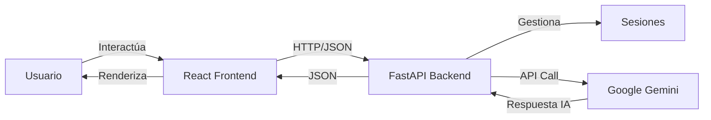

# 🤖 Agente Conversacional Full-Stack

> Sistema de chat inteligente con Google Gemini, FastAPI y React

[](https://www.python.org/)
[](https://fastapi.tiangolo.com/)
[](https://react.dev/)
[](https://vite.dev/)
[](https://ai.google.dev/)

---

## 📋 Descripción

Aplicación de chat full-stack con **inteligencia artificial** usando Google Gemini. Incluye:

### Backend
- ✅ **API REST** completa con FastAPI
- ✅ **Agente IA** usando Google Gemini 1.5 Flash (100% gratis)
- ✅ **Gestión de sesiones** para múltiples usuarios
- ✅ **Documentación automática** con Swagger UI
- ✅ **Validación de datos** con Pydantic

### Frontend
- ✅ **Interfaz moderna** con React + Vite
- ✅ **Diseño responsive** (móvil y desktop)
- ✅ **Modo oscuro automático**
- ✅ **Animaciones fluidas**
- ✅ **Manejo de errores** robusto

---

## 🏗️ Arquitectura



---

## 🚀 Instalación

### Requisitos Previos

- **Python 3.10+**
- **Node.js 18+**
- **Cuenta de Google** (para API Key de Gemini)

### Paso 1: Clonar el repositorio

```bash
git clone https://github.com/felixstiven/gemini-chat-agent.git
cd gemini-chat-agent
```

---

### 📦 Backend (Python + FastAPI)

#### 1. Navegar a la carpeta backend

```bash
cd backend
```

#### 2. Crear entorno virtual

```bash
python -m venv venv
```

#### 3. Activar entorno virtual

**Windows:**
```bash
.\venv\Scripts\activate
```

**Linux/Mac:**
```bash
source venv/bin/activate
```

#### 4. Instalar dependencias

```bash
pip install -r requirements/requirements.txt
```

#### 5. Configurar variables de entorno

Crea un archivo `.env` en `backend/`:

```env
GOOGLE_API_KEY=tu_api_key_aqui
MODEL_NAME=gemini-1.5-flash
MAX_TOKENS=1024
AMBIENTE=desarrollo
DEBUG=True
```

**Obtener API Key:** https://aistudio.google.com/

#### 6. Iniciar el backend

```bash
python -m uvicorn api.main:app --reload --port 8000
```

✅ **Backend corriendo en:** http://localhost:8000

---

### 🎨 Frontend (React + Vite)

#### 1. Navegar a la carpeta frontend

```bash
cd ../frontend
```

#### 2. Instalar dependencias

```bash
npm install
```

#### 3. Iniciar el frontend

```bash
npm run dev
```

✅ **Frontend corriendo en:** http://localhost:5173

---

## 🎮 Uso

### Opción 1: Interfaz Web (Recomendado)

1. **Inicia el backend** (puerto 8000)
2. **Inicia el frontend** (puerto 5173)
3. **Abre tu navegador:** http://localhost:5173
4. **¡Empieza a chatear!**

### Opción 2: Modo Consola

```bash
cd backend
python main.py
```

### Opción 3: API Directa

**Documentación interactiva:** http://localhost:8000/docs

---

## 📡 Endpoints de la API

| Método | Ruta | Descripción |
|--------|------|-------------|
| `POST` | `/api/chat/message` | Enviar mensaje al agente |
| `GET` | `/api/chat/stats/{session_id}` | Obtener estadísticas |
| `DELETE` | `/api/chat/clear/{session_id}` | Limpiar historial |
| `GET` | `/api/chat/sessions` | Listar sesiones activas |
| `GET` | `/health` | Health check |

### Ejemplo de Uso

```bash
curl -X POST "http://localhost:8000/api/chat/message" \
  -H "Content-Type: application/json" \
  -d '{
    "mensaje": "Hola, ¿cómo estás?",
    "session_id": null
  }'
```

**Respuesta:**
```json
{
  "respuesta": "¡Hola! Muy bien, ¿en qué puedo ayudarte hoy?",
  "session_id": "550e8400-e29b-41d4-a716-446655440000",
  "timestamp": "2026-01-23T15:30:00.123456",
  "tokens_usados": null
}
```

---

## 📁 Estructura del Proyecto

```
gemini-chat-agent/
├── backend/                    # Backend Python
│   ├── api/                    # API REST con FastAPI
│   │   ├── main.py            # Servidor principal
│   │   ├── models/
│   │   │   └── schemas.py     # Modelos Pydantic
│   │   └── routes/
│   │       └── chat.py        # Endpoints del chat
│   ├── agentes/
│   │   └── agente_gemini.py   # Lógica del agente IA
│   ├── config/
│   │   └── setting.py         # Configuración
│   ├── requirements/
│   │   └── requirements.txt   # Dependencias Python
│   ├── venv/                  # Entorno virtual
│   ├── main.py                # Modo consola
│   └── .env                   # Variables de entorno
│
├── frontend/                   # Frontend React
│   ├── src/
│   │   ├── components/        # Componentes React
│   │   │   ├── ChatMessage.jsx
│   │   │   ├── ChatInput.jsx
│   │   │   └── ChatWindow.jsx
│   │   ├── services/
│   │   │   └── api.js         # Servicio API
│   │   ├── App.jsx
│   │   ├── main.jsx
│   │   └── index.css          # Estilos globales
│   ├── public/
│   ├── package.json
│   ├── vite.config.js
│   └── index.html
│
├── .git/
├── .gitignore
└── README.md
```

---

## 🛠️ Tecnologías Utilizadas

### Backend
- **[FastAPI](https://fastapi.tiangolo.com/)** - Framework web moderno
- **[Google Gemini](https://ai.google.dev/)** - Modelo de IA generativa
- **[Pydantic](https://docs.pydantic.dev/)** - Validación de datos
- **[Uvicorn](https://www.uvicorn.org/)** - Servidor ASGI
- **[Python-dotenv](https://pypi.org/project/python-dotenv/)** - Variables de entorno

### Frontend
- **[React](https://react.dev/)** - Librería de UI
- **[Vite](https://vite.dev/)** - Build tool moderno
- **[CSS Variables](https://developer.mozilla.org/es/docs/Web/CSS/Using_CSS_custom_properties)** - Theming

---

## 🎯 Características

### ✅ Implementadas

#### Backend
- [x] API REST con FastAPI
- [x] Agente conversacional con Gemini
- [x] Gestión de sesiones
- [x] Documentación automática (Swagger)
- [x] Validación de datos con Pydantic
- [x] Manejo de errores robusto
- [x] CORS configurado

#### Frontend
- [x] Interfaz de chat moderna
- [x] Componentes React reutilizables
- [x] Diseño responsive
- [x] Modo oscuro automático
- [x] Animaciones CSS
- [x] Manejo de estados con hooks
- [x] Indicador de carga
- [x] Manejo de errores

### 🔜 Próximas Mejoras

- [ ] Autenticación con JWT
- [ ] Persistencia con base de datos
- [ ] Rate limiting
- [ ] WebSockets para streaming
- [ ] Historial persistente (localStorage)
- [ ] Markdown en mensajes
- [ ] Compartir conversaciones
- [ ] Tests unitarios
- [ ] Dockerización
- [ ] Deploy en producción

---

## 📚 Documentación

### Backend
- **Swagger UI:** http://localhost:8000/docs
- **ReDoc:** http://localhost:8000/redoc

### Frontend
- **Aplicación:** http://localhost:5173

---

## 🐛 Solución de Problemas

### Backend no arranca

```bash
# Verificar que el puerto 8000 esté libre
netstat -ano | findstr :8000

# Reinstalar dependencias
cd backend
pip install -r requirements/requirements.txt
```

### Frontend no carga

```bash
# Reinstalar dependencias
cd frontend
npm install

# Limpiar caché
npm run dev -- --force
```

### Error de CORS

Verificar en `backend/api/main.py`:
```python
allow_origins=["http://localhost:5173"]
```

---

## 🤝 Contribuciones

Las contribuciones son bienvenidas. Por favor:

1. Fork el proyecto
2. Crea una rama (`git checkout -b feature/AmazingFeature`)
3. Commit tus cambios (`git commit -m 'Add AmazingFeature'`)
4. Push a la rama (`git push origin feature/AmazingFeature`)
5. Abre un Pull Request

---

## 📄 Licencia

Este proyecto está bajo la Licencia MIT.

---

## 👤 Autor

**Dabinson Stiven Felix Alvis**
- GitHub: [@felixstiven](https://github.com/felixstiven)
- LinkedIn: [Stiven Felix](http://linkedin.com/in/stiven-felix-495273335/)

---

## 🙏 Agradecimientos

- [FastAPI](https://fastapi.tiangolo.com/) por el excelente framework
- [React](https://react.dev/) por la librería de UI
- [Google](https://ai.google.dev/) por Gemini API gratuita
- Comunidad open source

---

## 📞 Contacto

¿Preguntas o sugerencias? Abre un [issue](https://github.com/felixstiven/gemini-chat-agent/issues)

---

<div align="center">
  <strong>⭐ Si te gustó este proyecto, dale una estrella en GitHub ⭐</strong>
</div>
